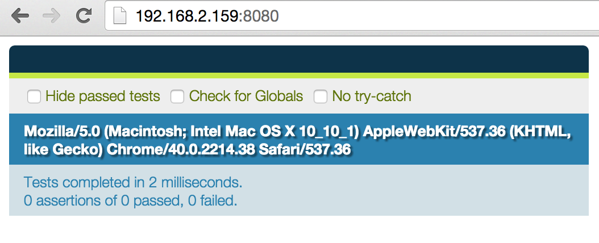

# first qunit test

i'm learning to get start with tdd with jquery. qunit is the first testing framework i pick.

## Setting things up

install jquery (of course we'll need jquery)

```sh
$ bower install --save jquery
```

then install qunit as a devDependency

```sh
$ bower install --save-dev qunit
```

create `index.html`

```html
<!doctype html>
<html>
	<head>
		<!-- bower:css -->
		<!-- endbower -->
	</head>
	<body>

		<!-- bower:js -->
		<!-- endbower -->
	</body>
</html>
```

use `wiredep` to include bower components in the page.

```sh
$ npm install --save-dev wiredep
```

```sh
$ node
> require('wiredep')({src: 'index.html', devDependencies: true});
```

start http server using `http-server`

```sh
$ npm install --save-dev http-server
$ http-server .
```

add these 2 `<div>`s in `<body>` tag.

```html
...
<body>
	<div id="qunit"></div>
	<div id="qunit-fixure"></div>
...
</body>
```

reload the page. qunit results should show up.



## First test

of course, a very basic one, `HelloWorld`.

add a `<script>` block in index.html. we want to test if `message` variable equals to `HelloWorld`.

```html
...
<script>
(function() {
	QUnit.test('HelloWorld example', function(assert) {
		assert.equal(message, 'HelloWorld', 'Expect message should be HelloWorld');
	});
})();
</script>
...
```

first i have a `Qunit.test()` function. first 1st argument is the test name. The 2nd argument is the test's body which is a function that has 1 argument: `assert`.

`assert` is an object for assertion: to test things.

in the test body, i have 1 assertion: `assert.equal()` to test if a thing is equal to another thing. this function accepts 3 arguments:
- 1st argument: actual result
- 2nd argument: expected result
- 3rd argument: assertion description (optional)

the test seems silly but just enough to see our first "red".


`message is not defined` seems obvious. let's make it defined.

```html
test('HelloWorld example', function() {
	var message;
	equal(message, 'HelloWorld', 'Expect message should be HelloWorld');
```


now `message` is defined. (though the value is still `undefined`). let's make the things right.

```html
test('HelloWorld example', function() {
	var message = 'HelloWorld';
	equal(message, 'HelloWorld', 'Expect message should be HelloWorld');
```

rerun the test, the test passes and the world is peaceful now.

